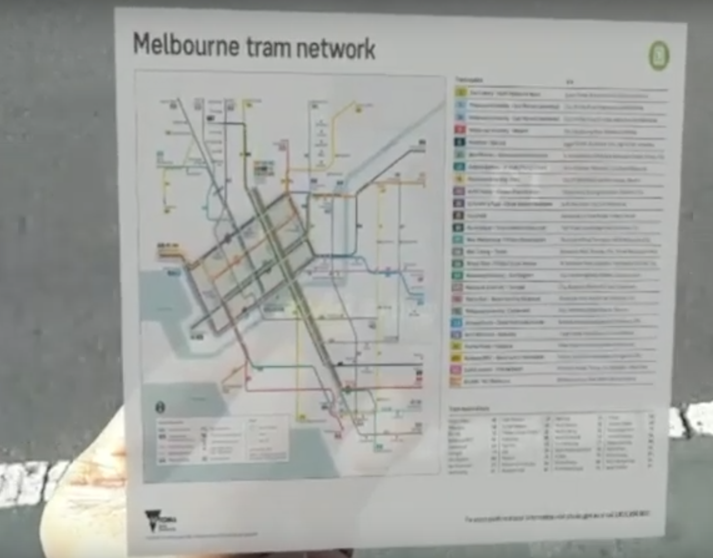
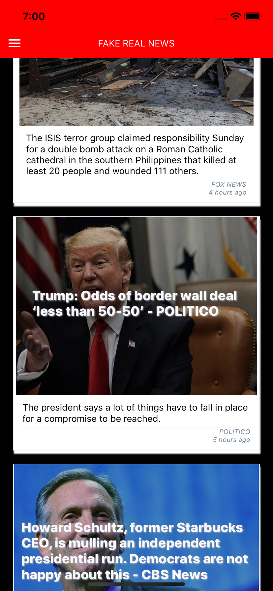

# MY PROJECTS

1. [VISIJAM](https://visijam.netlify.com)

   
   _click on the image to see a recording of the Github JAMstack hackathon livestream_

   - YouTube Video of the Github/FreeCodeCamp hackathon in SF, where visiJAM placed **in the top 6!**
   - uses ReactJS
   - uses JAMStack APIs
   - uses highcharts.js

2. [BOOK SCANNER](https://zp-book-scan-dev.netlify.com/)
   _dev version live_: Scan a book's barcode and share what you're reading with friends.
   

- React, hooks and ES6
- Computer Vision Libraries for Scanning Barcodes
- APIs for book data
- Mobile sharing options

3.  [WHOOSHKA PARKING](/whooshka.md) Google Assistant Voice App
    

        This relates to my Startup Whooshka. I developed this Voice App using:
        * Google Actions on Assistant
        * Google Dialogflow
        * Firebase (serverless) Cloud Functions for fulfillment
        * NodeJS and Javascript

4.  AUGMENTED REALITY TRAM MAP (click the image for video)

5. **REACT NATIVE APP - "Real FakeNews App"**
   

- React Native (X-platform)
- fetch API and state refresh
- FlatList and refresh functionality
- React Native Elements library
- Flex styling
- Class Components and Functional Components (reusable)

6. [BLOG APP](https://zubinstestblog.herokuapp.com)

   - Node, Express
   - Passport authentication
   - MongoDB/Mongoose/ MLabs
   - RESTful routes, many protected by auth requirement
   - Edit/Comment functionality, depending on auth status

   

7. [REALTIME CHAT APP](https://codelabs-practice.firebaseapp.com/)

   - vanilla JavaScript / HTML
   - Firebase real-time database
   - Firebase Cloud Messaging for Notifications
   - Firebase auth for user auth

   
