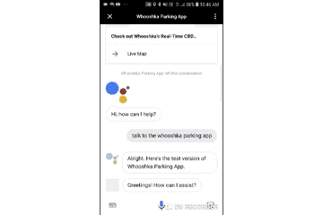

# MY PROJECTS
1. [VISIJAM](https://visijam.netlify.com)
    
    
    _click on the image to see a recording of the Github JAMstack hackathon livestream_
     
    * YouTube Video of the Github/FreeCodeCamp hackathon in SF, where visiJAM placed __in the top 6!__   
    * uses ReactJS    
    * uses JAMStack APIs    
    * uses highcharts.js

2. [WHOOSHKA PARKING](/whooshka.md) Google Assistant Voice App

    This relates to my Startup Whooshka. I developed this Voice App using:
    * Google Actions on Assistant
    * Google Dialogflow
    * Firebase (serverless) Cloud Functions for fulfillment
    * NodeJS and Javascript

3. __REACT NATIVE APP -  "Real FakeNews App"__

* React Native (X-platform)
* fetch API and state refresh
* FlatList and refresh functionality
* React Native Elements library
* Flex styling
* Class Components and Functional Components (reusable)

4. [BLOG APP](https://zubinstestblog.herokuapp.com)    
    * Node, Express
    * Passport authentication
    * MongoDB/Mongoose/ MLabs
    * RESTful routes, many protected by auth requirement
    * Edit/Comment functionality, depending on auth status

    

4. [REALTIME CHAT APP](https://codelabs-practice.firebaseapp.com/)
    * vanilla JavaScript / HTML
    * Firebase real-time database
    * Firebase Cloud Messaging for Notifications
    * Firebase auth for user auth

    

5. [YOUTUBE CLONE](https://github.com/zeuslawyer/React-Redux/tree/master/1_react_youtube_clone)
    * React
    * YouTube API
    * Axios for asynchronous calls using JS Promises
    * Component State Management & Props using ES6 fat arrow functions
    * UI Event Handlers, with state updates
    * .env and gitignore to protect keys
    
    